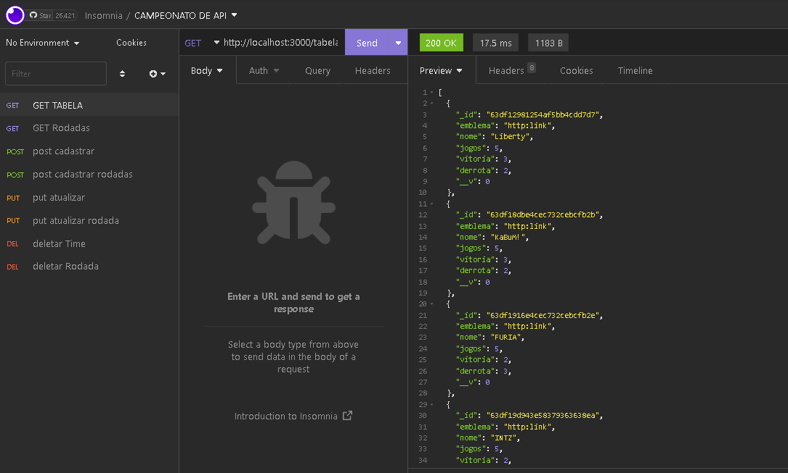
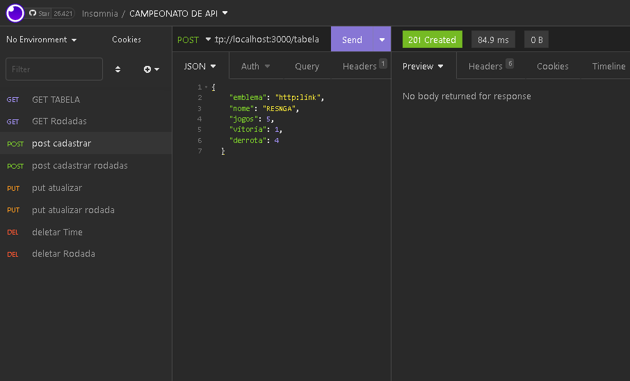
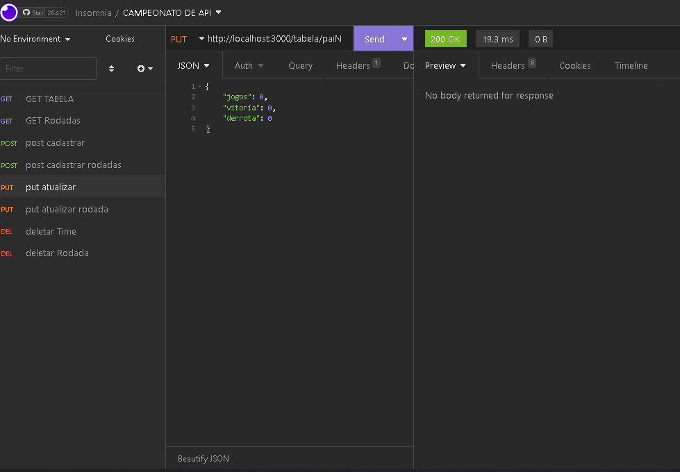
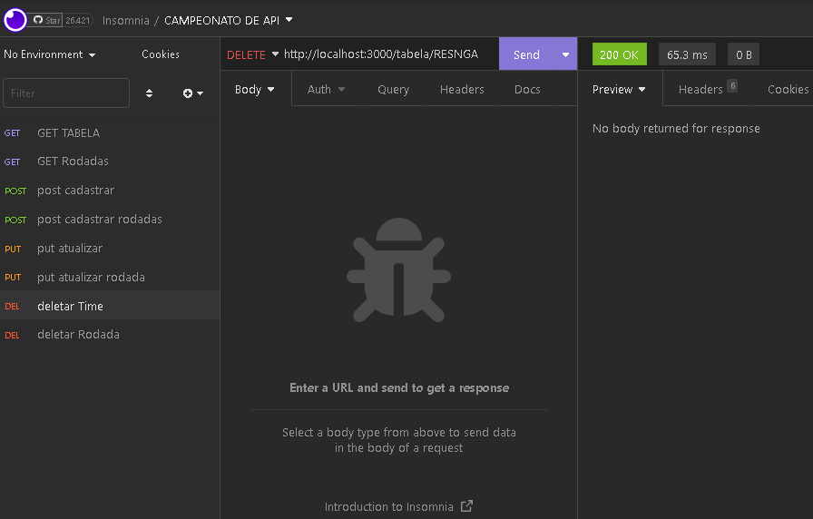
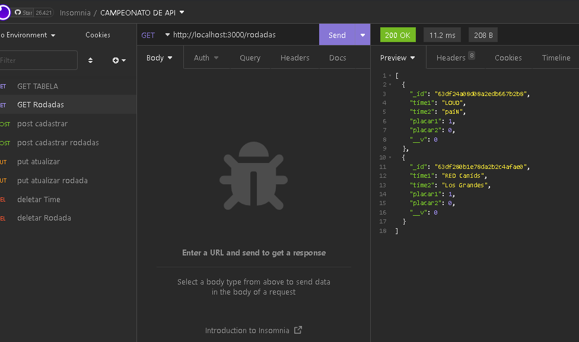
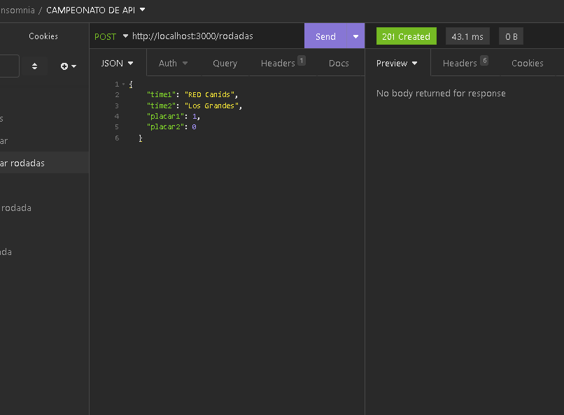
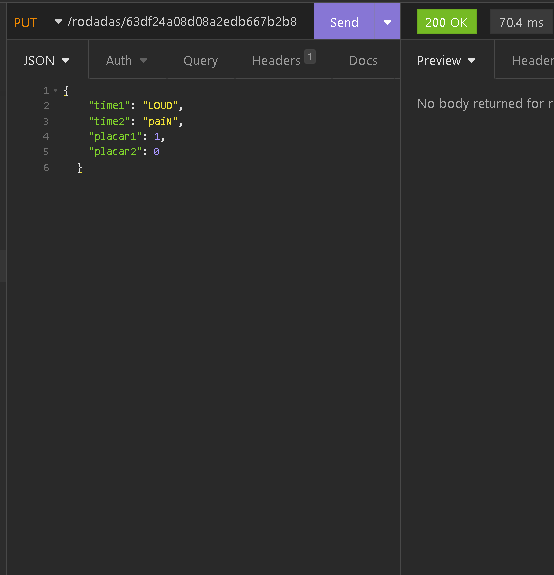
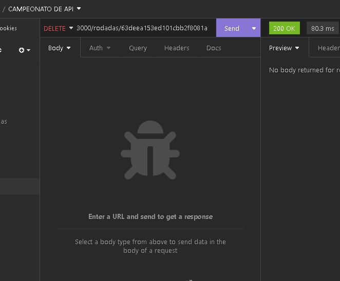

# API sobre sports eletronicos CAMPEONATO SIMULADOR EM NODEJS

## ESTE PROJETO TEM o objetivo de cadastrar times , listar jogos, e exibir a classificação de jogos

### 🛠 Tecnologias

As seguintes ferramentas foram usadas na construção do projeto:
 - [NODE.JS]
 - [MongoDB]

#### para habilitar a aplicação

- precisa ter o banco de dados mongodb instalado
- possuir nodejs instalado
- instalar os pacotes na pasta raiz do projeto comando [npm install]
- startar a aplicação na pasta raiz do projeto pelo comando [npm run dev]
- ter postman ou insomnia instalado para ter a visibilidade dos testes e demostração

#### demostração retorno da tabela de classificação ordenada pela quantidade de vitorias

#### demostração cadastro de time

#### demostração atualização de time

#### demostração delete de time

#### demostração retorno de rodadas com os jogos dos times

#### demostração cadastro de rodadas

#### demostração atualizar rodadas

#### demostração deletar rodadas

